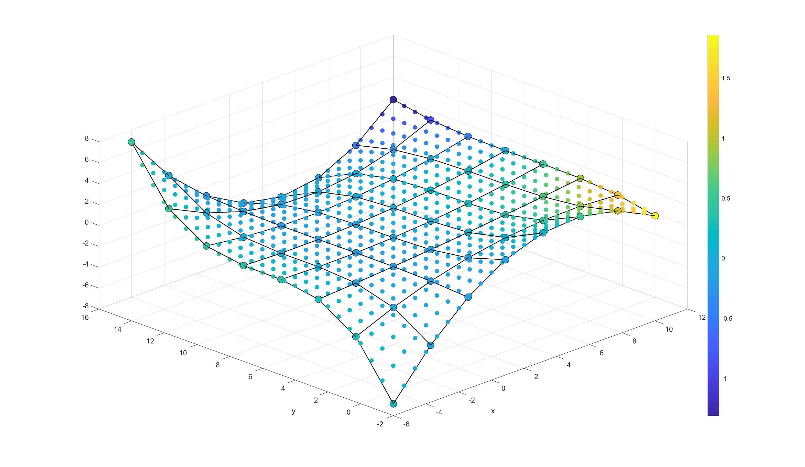

# 2D-3D-Fitting

Linear Fit for 2D and 3D

Linear fit does not mean fit a line, any function can be written as A*X=Y is linear fit

Functions:

- polyfit2
- PolyInterpSurf
- PolyInterpScatterZ
- polyfit3
- PolyInterpScatterMag
- bezierfit2:
- BezierInterpSurf
- BezierInterpScatterZ
- bezierfit3
- BezierInterpScatterMag

